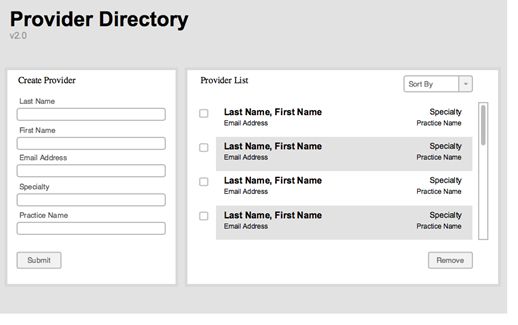

# Updox Interview

It was a pleasure meeting you today.  For this challenge, point me to your github repo when finished or send me a git bundle.  Please push a commit at the 1 hour of work point so I can review your early progress.  After that you can take whatever time you need to complete the project.  I encourage you to be creative while also thinking about usability. Feel free to contact me with any questions.

# UI Challenge:

Provider Directory v2.0



## Background:

The provider directory helps healthcare providers find and connect with other healthcare providers.  It acts as a personal address book of provider email addresses.  Specialty is very important when searching as providers often look for available providers within in a particular specialty.
 
 
## Requirements
 
- Should load the data below into the existing data section on page load.
- Should have the ability to create providers that will immediately prepend to the list on submit.
- Should have the ability to remove selected providers from the list.
- Should have the ability to sort the list by any of the fields, both ascending and descending.
- Type ahead searching is a nice to have.
- Should not require a web server, and should be able to run offline.
- Last Name, First Name and Email Address are required fields.
- Match the spirit of the mock up but artistic freedom is encouraged.
    - Be prepared to discuss the design choices you make.
- All data exchanges should be in JSON format.
    
## Existing Data (JSON)

```json
[
    {"last_name": "Harris", "first_name": "Mike", "email_address": "mharris@updox.com", "specialty": "Pediatrics", "practice_name": "Harris Pediatrics"},
    {"last_name": "Wijoyo", "first_name": "Bimo", "email_address": "bwijoyo@updox.com", "specialty": "Podiatry", "practice_name": "Wijoyo Podiatry"},
    {"last_name": "Rose", "first_name": "Nate", "email_address": "nrose@updox.com", "specialty": "Surgery", "practice_name": "Rose Cutters"},
    {"last_name": "Carlson", "first_name": "Mike", "email_address": "mcarlson@updox.com", "specialty": "Orthopedics", "practice_name": "Carlson Orthopedics"},
    {"last_name": "Witting", "first_name": "Mike", "email_address": "mwitting@updox.com", "specialty": "Pediatrics", "practice_name": "Witting’s Well Kids Pediatrics"},
    {"last_name": "Juday", "first_name": "Tobin", "email_address": "tjuday@updox.com", "specialty": "General Medicine", "practice_name": "Juday Family Practice"}
]
```
 
# Prime Number Challenge

Attached is the coding challenge that I would like you to complete.  With this challenge, I focus on code quality/readability, tests, the algorithm you choose and your ability to follow the requirements.  I am not as worried about a fancy interface although if you want to do that, that would be fine too.  I do however need a main program that I can execute and pass in parameters to test your code.  I also need to see tests that prove and cover your code.  When you complete this challenge point me to a github repo or send me a git bundle.  I look forward to seeing your work.  Also, feel free to ping me with any questions you may have. 
